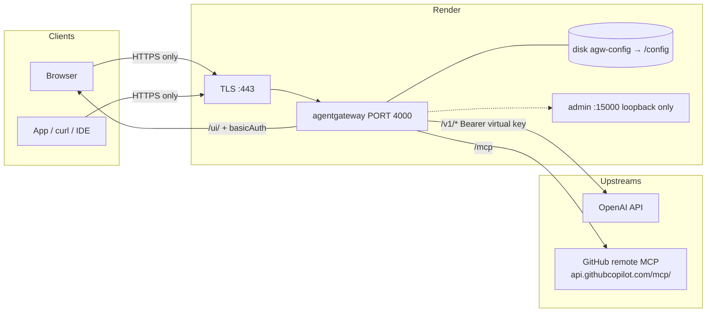

## Render Deploy Example

This example deploys standalone agentgateway on [Render](https://render.com) as a Docker web service with a public **HTTPS** URL.

Render terminates TLS on `:443` and forwards to the container’s `PORT=4000`. Do not publish `:4000` yourself, and do not call the service over `http://`.

**Canonical Blueprint:** [`render.yaml`](./render.yaml) in this folder.

| How you create it | What to set |
|-------------------|-------------|
| Deploy-to-Render button | `path=examples/render-deploy/render.yaml` (Render’s query param is `path`, not `blueprintPath`) |
| Dashboard → New Blueprint | **Blueprint Path** = `examples/render-deploy/render.yaml` |

[](https://render.com/deploy?repo=https://github.com/agentgateway/agentgateway&path=examples/render-deploy/render.yaml)

`dockerfilePath` / `dockerContext` inside the YAML stay relative to the **repo root** (`./examples/render-deploy/Dockerfile`), even though the Blueprint file lives under `examples/render-deploy/`.

The image this service builds is this folder’s [`Dockerfile`](./Dockerfile): a thin wrapper around the official `cr.agentgateway.dev/agentgateway` image. The wrapper writes `/config/.htpasswd` on every start and seeds `config.yaml` on first boot. Do **not** pick **Existing Image** → `cr.agentgateway.dev/agentgateway:v1.5.0`. Empty `/config` auto-gen serves `/ui/` with **no auth**.

## Architecture

Render gives you **one** public port. UI, LLM, and MCP therefore share `gateways.default` on `:4000` and split by path. Admin `:15000` is loopback-only inside the container. Config, htpasswd, and SQLite live on disk **`agw-config`** mounted at **`/config`**.



| Public path | Who it is for | Auth |
|-------------|----------------|------|
| `/ui/` | Operators | HTTP basic (`UI_USER` / `UI_PASSWORD`) |
| `/v1/*` | Apps, playground, `curl` | `llm.policies.apiKey` **strict** — Bearer virtual key |
| `/mcp` | MCP clients | GitHub PAT on the upstream target |

`ui.policies` does **not** cover `/v1/*`. Do not send the UI password as an LLM Bearer token.

## Example layout

| Fact | Value |
|------|--------|
| Service | Web Service, Docker, **Starter** |
| URL | `https://<your-service>.onrender.com` — **HTTPS only** |
| Disk | **`agw-config`** → **`/config`**, 1 GB |
| UI | `/ui/` basic auth via `UI_USER` + `UI_PASSWORD` |
| LLM | OpenAI wildcard `*` on `/v1/*` |
| MCP | GitHub remote Copilot MCP on `/mcp` (Streamable HTTP) |
| Admin | `:15000` on `127.0.0.1` — not on the internet |

Virtual API keys (`llm.policies.apiKey` `mode: strict`):

| Key (placeholder) | `metadata.name` | Models | Extra |
|-------------------|-----------------|--------|-------|
| `sk-lab-admin-...` | `admin` | any | — |
| `sk-lab-demo-...` | `demo` | selected models | — |
| `sk-lab-limited-...` | `limited` | `gpt-4.1-nano` | rolling token budget |

Rotate anything that ever leaked. The strings above are placeholders — they are not live secrets.

Example config (same shape as [`config.example.yaml`](./config.example.yaml)):

```yaml
llm:
  policies:
    apiKey:
      mode: strict
      keys:
      - key: sk-lab-admin-...
        metadata: { name: admin }
      - key: sk-lab-demo-...
        metadata: { name: demo }
        allowedModels: [gpt-4.1-nano, gpt-4.1, gpt-4o]
      - key: sk-lab-limited-...
        metadata: { name: limited }
        allowedModels: [gpt-4.1-nano]
        budgets:
        - name: tokens
          limit: { unit: Tokens, amount: 1000 }
          window: { rolling: 1h }
          onBudgetExceeded: Block
```

A `GET /v1/models` with no `Authorization` header returns `api key authentication failure: no API Key found`. That is the strict policy working.

## Environment variables

Set these in the Render **Environment** tab. Never commit real values. See [`.env.example`](./.env.example).

| Variable | Required | Purpose |
|----------|----------|---------|
| `PORT` | **Yes** | Must be `4000`. Render proxies `$PORT` (default `10000`); the gateway listens on 4000. |
| `UI_USER` | No | Basic-auth username. Default `admin`. |
| `UI_PASSWORD` | **Yes** | Entrypoint writes `/config/.htpasswd` every start. Process exits 1 if unset. |
| `OPENAI_API_KEY` | For OpenAI | Expanded as `$OPENAI_API_KEY` on the model. |
| `GITHUB_PERSONAL_ACCESS_TOKEN` | For GitHub MCP | Bearer the gateway sends to `api.githubcopilot.com`. |

## How to deploy

### 1. Create the Render web service

**Button / Blueprint** — prefer this folder’s Blueprint:

[](https://render.com/deploy?repo=https://github.com/agentgateway/agentgateway&path=examples/render-deploy/render.yaml)

- One-click URL uses `path=examples/render-deploy/render.yaml` (required when the file is not at repo root).
- Dashboard: **Blueprint Path** = `examples/render-deploy/render.yaml`.
- File: [`render.yaml`](./render.yaml).

From a fork, create a Blueprint against that repo and set the same Blueprint Path.

**Manual** — New → Web Service → this repo, Docker, `./examples/render-deploy/Dockerfile`, context `./examples/render-deploy`. Do **not** pick **Existing Image** → `cr.agentgateway.dev/agentgateway:v1.5.0`. Empty `/config` auto-gen serves `/ui/` with **no auth**.

`autoDeployTrigger: off` so pushes to this repository do not redeploy every copy of the button. Do not also set `autoDeploy` — Render rejects a Blueprint that includes both.

### 2. Set the env vars

Render prompts for `sync: false` keys on first Blueprint create. Pin `PORT=4000`. Generate `UI_PASSWORD` in the dashboard. Paste provider tokens there, not into git.

### 3. Disk

The Blueprint already declares **`agw-config`** → **`/config`**, 1 GB. Disks are not available on Render Free — Starter is the floor. Without the volume, config and analytics reset on every deploy.

### 4. Deploy

First boot writes `.htpasswd` + a seed `config.yaml`, then the gateway watches `/config/config.yaml`. In Render logs you want:

- `state_manager Watching config file: /config/config.yaml`
- `app serving UI at http://localhost:4000/ui`
- `proxy::gateway started bind bind="bind/4000"`
- admin on `127.0.0.1:15000`
- `==> Your service is live`

A `http.status=401` on `/ui/` with `basic authentication failure: no basic authentication credentials found` is success. Health checks must **not** `GET /ui/` (401 ≠ healthy). The Blueprint omits `healthCheckPath` so Render uses TCP on `:4000`.

### 5. Open the UI over HTTPS

```
https://<your-service>.onrender.com/ui/
```

Browser basic-auth prompt: `UI_USER` / `UI_PASSWORD`. Gateway Overview should show LLM, MCP, and Traffic on gateway **default**.

### 6. Add OpenAI

**LLM → Models → Add model.** Incoming name `*`, provider OpenAI, API key `$OPENAI_API_KEY`. Outgoing model stays “Incoming model.”

### 7. Add virtual keys

**LLM → Virtual API Keys** (or edit `/config/config.yaml`). Strict mode. Three lab keys: `admin` (any), `demo` (selected models), `limited` (`gpt-4.1-nano` + token budget). Use placeholders in docs; paste real secrets only in the dashboard / disk.

### 8. Call chat completions (HTTPS + Bearer)

The playground’s wildcard row needs a **specific model** before Send is enabled. From a client:

```sh
export HOST=https://<your-service>.onrender.com
export VKEY='sk-lab-limited-...'   # placeholder — use your lab key

curl -sS "$HOST/v1/chat/completions" \
  -H "Authorization: Bearer $VKEY" \
  -H 'Content-Type: application/json' \
  -d '{
    "model": "gpt-4.1-nano",
    "messages": [{"role": "user", "content": "Reply with one word: pong"}]
  }'
```

A 200 with token usage shows up under **LLM → Logs**.

### 9. Add GitHub MCP

**MCP → Servers → Add server.**

- Name: `github`
- Type: **Streamable HTTP**
- Endpoint: `https://api.githubcopilot.com/mcp/`

Attach MCP to the existing `default` gateway (no second public port). Auth is a backend key:

```yaml
mcp:
  gateways: [default]
  targets:
  - name: github
    mcp:
      host: https://api.githubcopilot.com/mcp/
    policies:
      backendAuth:
        key:
          value: $GITHUB_PERSONAL_ACCESS_TOKEN
```

State should go **ready**. Clients use `https://<your-service>.onrender.com/mcp`.

## Ports and limits

Render publishes **HTTPS :443** to one container port. That port is `4000`. There is no public `:4000` URL and no public admin.

| Address | Reachable from the internet? |
|---------|------------------------------|
| `https://<service>.onrender.com/ui/` | Yes, basic auth |
| `https://<service>.onrender.com/v1/*` | Yes, virtual API key |
| `https://<service>.onrender.com/mcp` | Yes, MCP |
| `http://<service>.onrender.com/...` | Do not use |
| `:4000` on the public hostname | Do not use |
| `:15000` | No — loopback only |

Starter is enough for a demo. The disk is the persistence story.

## Security

`ui.policies.basicAuth` `mode: strict` plus file htpasswd (`{SHA}` lines the entrypoint rewrites every start). Unauthenticated `GET /ui/` is **401** and `WWW-Authenticate: Basic realm="agentgateway"`.

That is **demo-grade** behind Render TLS. It is not an IdP.

- Rotate `UI_PASSWORD`, `OPENAI_API_KEY`, `GITHUB_PERSONAL_ACCESS_TOKEN`, and every virtual key if this URL is more than a lab.
- Scope the GitHub PAT. Remote Copilot MCP will do whatever that token can do.
- `{SHA}` / HTTP basic is not SSO.

Inline bcrypt in `config.yaml` is a footgun: hashes contain `$`, and agentgateway env-expands `$VARS`. That is why the entrypoint uses a file.

## Verify

HTTPS only. Placeholders, not real secrets.

```sh
HOST=https://<your-service>.onrender.com

# UI locked
curl -sI "$HOST/ui/" | grep -E 'HTTP/|www-authenticate'
# HTTP/2 401
# www-authenticate: Basic realm="agentgateway"

curl -sI -u "$UI_USER:$UI_PASSWORD" "$HOST/ui/" | head -5
# HTTP/2 200

# LLM requires a virtual key
curl -sS "$HOST/v1/models"
# api key authentication failure: no API Key found

curl -sS "$HOST/v1/models" -H "Authorization: Bearer sk-lab-admin-..."
curl -sS "$HOST/v1/chat/completions" \
  -H "Authorization: Bearer sk-lab-limited-..." \
  -H 'Content-Type: application/json' \
  -d '{"model":"gpt-4.1-nano","messages":[{"role":"user","content":"Reply with one word: pong"}]}'
# limited is gpt-4.1-nano + token budget — expect 429 budget_exceeded after the window fills

# MCP — GitHub remote (POST)
curl -sS "$HOST/mcp" \
  -H 'Content-Type: application/json' \
  -H 'Accept: application/json, text/event-stream' \
  -H 'mcp-protocol-version: 2025-06-18' \
  -d '{"jsonrpc":"2.0","id":1,"method":"initialize","params":{"protocolVersion":"2025-06-18","capabilities":{},"clientInfo":{"name":"howto","version":"1"}}}'
# look for serverInfo.name: github-mcp-server
```

A 401 on `/ui/` without credentials, a 200 with them, a 401 on `/v1/models` without a Bearer key, and an MCP `initialize` that names `github-mcp-server` is the smoke test.
